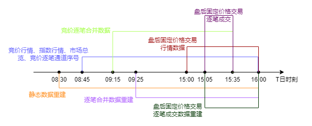
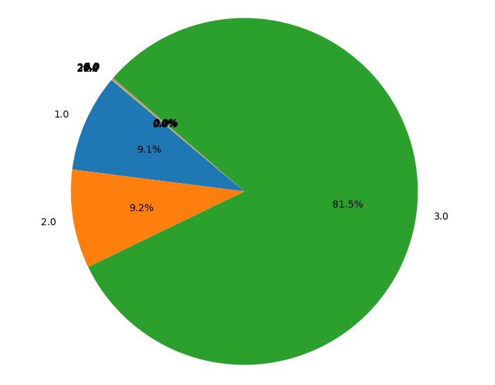
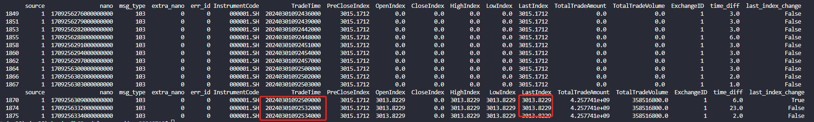
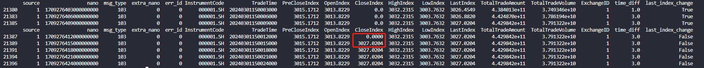
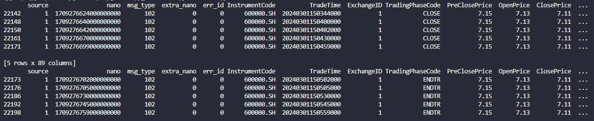

# 沪深两所行情相关信息整理

#### ChangeLog (Desc by date)
 
| Date | Reviser | Description |
| ------ | --- | ----- |
| 2024/07/21  | huaisy  | 创建 |

#### Reference
 
| 序号 | 文件名 | 最新修订日期 | 文档位置 |
| ------ | --- | ----- | ---- |
| 1 | 上海证券交易所LDDS系统竞价Level-2行情接口说明书  | 2024/07/01 | <https://www.sseinfo.com/services/assortment/document/> |
| 2 | 上海证券交易所 LDDS系统静态数据接口说明书 | 2023/10/30 | <https://www.sseinfo.com/services/assortment/document/> |
| 3 | 深圳证券交易所数据文件交换接口规范 | 2023/04 | <https://www.szse.cn/marketServices/technicalservice/interface/> |


## 1.概述

&ensp;在阅读沪深交易所关于行情的文档后，对两所发布行情认识逐渐加深。所谓行情，是由交易所作为源头发布，经由行情商等机构接取，最后流向下游按需使用。根据两所业务类型，行情种类丰富多样。其中，以竞价Level-2行情作为本次主要研究对象；在竞价产品中，又以股票产品为切入点，以更快地理解并参与生产。

&ensp;该报告中的内容结合了公开文档和个人认知，仅作为团队内分享用。

## 2.行情知识梳理

### 2.1.行情分类

&ensp;主观来看，沪深交易所的文档能力亦有差异。上交所通过行情发布系统LDDS说明+该系统按发布产品展开的接口说明+行情数据产品说明书+市场参与者接口等众多文档，互相之间引用重叠，达成了“孤木难支，众擎易举”的效果。深交所则按照行情发布方式（Binary|STEP）编写文档，涵盖如何接入、提供哪些服务、接口定义、数据字典等内容，对于想要更快了解心中困惑的人而言，简直是“有心之云，及时之雨”。

&ensp;行情分类可以有以下方式：
  - 按发布类型
    - 静态文件
    - 动态数据
  - 按业务内容
    - 市场状态
    - 公告
    - 具体业务（竞价、债券等，篇幅原因不展开）
  - 按发布逻辑
    - 快照：按照类别频率发布
    - 逐笔：频道内序号递增发布
  - 其他（非主要研究对象）

#### 2.1.1.静态文件
&ensp;静态文件类别较多，本节主要针对交易所生成的交易参考信息展开。
1. 上交所静态文件
    1. 概况
    上交所静态文件均为T日发送，大部分文件内容固定不变，也有特殊的如竞价行情文件、债券行情文件实时增长。
    2. 时间表
        - 8:00
            - 融资融券文件 `dbpMMDD.txt`
            - 重点指数表现文件 `zsbxYYMMDD.txt`
            - 产品基础信息第二版第一批次文件 `cpxx0201MMDD.txt`
            - 产品基础信息第二版第二批次文件 `cpxx0202MMDD.txt`
            - 产品非交易基础信息文件 `fjyYYYYMMDD.txt`
            - 基金非交易基础信息文件 `jfjyYYYYMMDD.xml`
            - 债券非交易基础信息文件 `zfjyYYYYMMDD.xml`
            - 竞价行情文件 `mktdt00.txt`
            - 债券行情文件 `mktdt02.txt`
            - 沪伦通收盘行情文件 `LSE_EODSUMMARY_<YYYYMMDD>.CSV`
            - 沪伦通GDR基本信息增量文件 `se038gdrjbxxYYYYMMDD001.txt`
            - 产品简称文件 `cpjcMMDD.txt`
            - 定向可转债成交明细信息文件 `se060dxkzzcjYYYYMMDD001.txt`
            - 基金及公募REITs业务参数公告文件 `sfpm01MMDD.txt`
            - 期权基础信息 `reff03mmdd.txt`
            - 期权基础信息第二版文件 `reff0302YYYYMMDD.xml`
            - 期权组合策略文件 `zhcl03MMDD.txt`
            - 交易参与人清单 `se015jycyrYYYYMMDD001.txt`
            - 交易员清单 `se015jyyYYYYMMDD001.txt`
            - 国际化产品信息文件 `ifjyyyyymmdd.xml`
            - 债券产品信息文件 `archive_bondinfoYYYYMMDD.zip`
            - 证券信息参考文件 `se015zqxxyyyymmdd002.txt`
            - 国债利息文件 `gzlx.MDD`
        - 9:30
            - 沪伦通GDR基本信息全量文件 `se060gdrjbxxYYYYMMDD001.txt`
        - 16:15
            - 期权收盘价格 `clpr03mmdd.txt`
        - 17:30
            - 主板交易公开信息公告文件 `jygkxxMMDD.txt`
            - 科创板交易公开信息公告文件 `jygkxx02MMDD.txt`
2. 深交所静态文件
    1. 概况
    深交所静态文件在每个交易日（后称T日）开市前发送两边，第一遍为T-1日盘后，第二遍为T日盘前，通过`pre`文件前缀区分。第一遍和第二遍数据可能有差异，也可能只发送第二遍，因此以第二遍数据为准。
    2. 时间表
    暂未找到明确的时间说明。

#### 2.1.2.动态数据
&ensp;除静态文件外，通过动态数据获取实时行情信息。本节对两所动态数据类型和特征进行描述，并不会对数据内容展开讨论。
1. 概况
    
    上交所动态数据整体分为3类：快照类、逐笔成交类、逐笔合并类。其中，逐笔成交类特指盘后固定交易价格逐笔成交数据，而竞价的逐笔成交和逐笔委托都放在逐笔合并类中。

2. 时间表（交易日）
    
3. 快照类数据发布频率
    1. 上交所变化全量：3秒/幅，若和上幅无区别，则顺延，直至发布周期全量；
    2. 上交所周期全量：30秒/幅，盘后固定价格交易行情为6秒/幅，无论是否变化均发布；
    3. 深交所市场实时状态：3秒/幅；
    4. 深交所证券实时状态：15秒/幅；

## 3.行情数据中的疑点

### 3.1.指数行情
* 发布周期不一定是3秒/幅
    
  通过筛选20240301日l2index中上交所发布的（ExchangeID=2）证券代码为000001.SZ（InstrumentCode=‘000001.SZ'）的记录，并将每一行`nano`列减去上一行的值作为`time_diff`列，用于表示两条连续记录之间的时间差。
  
  在时间差这一列中，3秒是众数，其次是2秒和1秒，以几乎相同的频率出现；还有个别差值远超过3秒，达到28秒。
  具体分布频次为
  ```
  Value Counts:
  Value 1.0: 809
  Value 2.0: 818
  Value 3.0: 7246
  Value 5.0: 2
  Value 6.0: 2
  Value 9.0: 5
  Value 20.0: 1
  Value 23.0: 1
  Value 28.0: 10
  Value 29.0: 1
  ```
  下图为以上数据绘制的饼图。
  

  同样地，筛选当日深交所发布的证券代码为399001.SZ的记录，具体分布频次为：
  ```
  Value Counts:
  Value 3.0: 4743
  Value 48.0: 3
  Value 51.0: 1
  Value 60.0: 256
  Value 69.0: 4
  ```
  经观察得出的规律：在连续竞价阶段，行情稳定以3秒/幅下发，在没有产生行情的交易阶段，以60秒/幅的频率更新(有点像心跳)，其他异常值通常在交易状态转换时发生。相较于上交所，深交所的指数行情数据更为规整。

* 数据变化时间范围

  虽然从8:45开始就可以接收到行情数据，但是对于指数行情，实际从9:25分开始变化(观察下图红框)

  
  
  午间休市时，也不发生变化。值得注意的是，在15:00闭市后，产生比市价的一幅（红框），在此之后指数行情也就不再变化了。

  

* 上交所间隔为1秒和2秒的行情，是从哪里来的？为什么近乎成对出现？（TODO: 提问）

### 3.2.竞价行情
* TradingPhaseCode字段的含义
  
  在上交所的竞价行情快照数据中，TradingPhaseCode表示交易状态，取值如下表所示：
  | 取值 | 含义 | 时间段 |
  | --- | --- | --- |
  | START | 启动 | 8:45-9:15 |
  | OCALL | 开盘集合竞价 | 9:15-9:25 |
  | TRADE | 连续竞价 | 9:25-14:57 |
  | SUSP | 停牌 |  |
  | CCALL | 收盘集合竞价 | 14:57-15:00 |
  | CLOSE | 闭市，结算闭市价 | 15:00后 |
  | ENDTR | 交易结束 | 15:00后 |

  
  
  由于上交所文档中只提到先发TRADE再发ENDTR，并没有指出明确的转换逻辑，以上图600000.SH发生状态转换临界区数据为例，看不出明显的变化。（TODO: 问秀姐）

  在深交所的竞价行情快照数据中，TradingPhaseCode表示交易阶段代码，由2位组成：
  
  第0位取值及含义：
  | 取值 | 含义 |
  | --- | --- |
  | S | 启动（开市前） |
  | O | 开盘集合竞价 |
  | T | 连续竞价 |
  | B | 休市 |
  | C | 收盘集合竞价 |
  | E | 已闭市 |
  | H | 临时停牌 |
  | A | 盘后交易 |
  | V | 波动性中断 |
  
  第1位取值及含义：
  | 取值 | 含义 |
  | --- | --- |
  | 0 | 正常状态 |
  | 1 | 全天停牌 |
  
  TODO: 对数据进行进一步观察分析，至少从发布周期、变化范围的角度出发，分上交所和深交所2类。

## 4.关于上交所行情

经过沟通了解，上交所的行情数据从生产到市场参与者接入，这之间有许多颠覆我想象的事情。在此提出整理：

1. 行情的源头是竞价交易平台（MTP）
  
    MTP接收到来自市场参与者的委托，内部术语为申报（包括订单和撤单）。由于本人对竞价的代码和业务流程不是很熟悉，行情产生的过程可以概述为：
    * 市场参与者（券商）通过报单软件填写订单，需要填写申报要素如交易方向、数量、价格等，发送到交易后台
    * 后台经过前端检查、风控（同一会员检查等），将申报（一条消息）编码发往MTP
    * MTP架构层收到消息后，按照业务类型、消息类型，转发到具体进程处理
    * 进程拿到消息后，解码并填充到一个数据结构内，经过必要的校验（账户状态等），确定是合法的申报，则在订单簿内存中插入一条记录
    * 插入订单簿的申报，通常视为被后台接收，会产生一条订单确认，内部术语为OC（Order Confirm），内容可参考IS101接口文档中的申报确认接口ORDWTH2
    * OC流发送给数据下游，其中之一叫做**行情网关**，将在之后介绍。
    * 撮合模块我并不了解，方才的申报通过撮合产生成交时，会产生一条撮合，内部术语为TC（Trade Confirm），内容可参考IS101接口文档中的成交回报接口cjhb
    * TC和OC一样，会发送给数据下游
    * 在以上过程中，订单簿内存发生变化，按照固定周期，在行情文件mktdt00.txt中更新记录，并推送给下游
    * 以上数据，还通过**市场参与者柜台系统**同上交所交易系统之间的实时接口传输

2. 行情网关与信息公司

    上文中，共提到3类数据，分别为OC、TC、mktdt00.txt。实际上，MTP推送的数据更加多样。
    行情网关可以理解为一道桥梁，连接了技术公司负责的交易后台，和信息公司负责的行情发布系统LLDS。
    
    对于信息公司，并不是把行情原封不动的发布给下游，需要**至少**经过这一步骤：
    * 通过OC和TC重构订单簿：通过收到的逐笔OC和TC，更新自己的订单簿系统。这样做的目的是，便于计算实时行情。

    因此，对于许多解释不了的时间戳的问题，现在都有了答案：
    * 后台的OC中的时间戳，是后台接收确认的时间
    * 后台的TC中有两个时间：申报时间，指主动买卖的一方申报该条委托的时间；成交时间，指该笔委托撮合成交的时间
    * mktdt00.txt中的时间戳，是后台按照定时器追加一条记录时的时间
    * OC和TC到了信息公司，重构订单簿时，到底是站在后台订单簿视角，还是站在自己订单簿视角，现在还不明确
    * mktdt00.txt是竞价后台定义的数据格式，没理由在信息公司进行修正，应该原封不动的发送给市场。因此我的推测是，mktdt00.txt才是精度最高的行情。