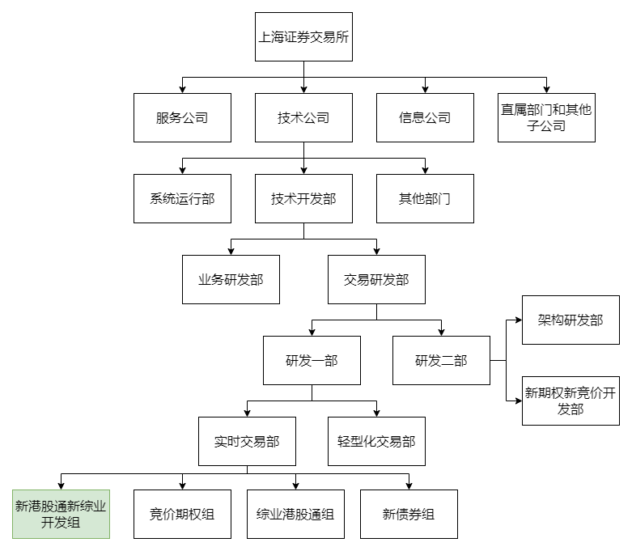
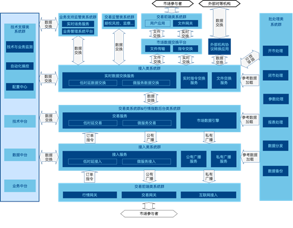
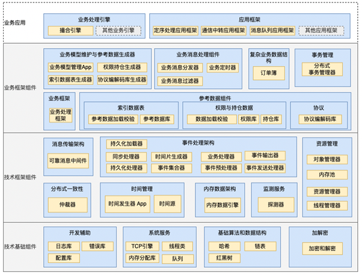
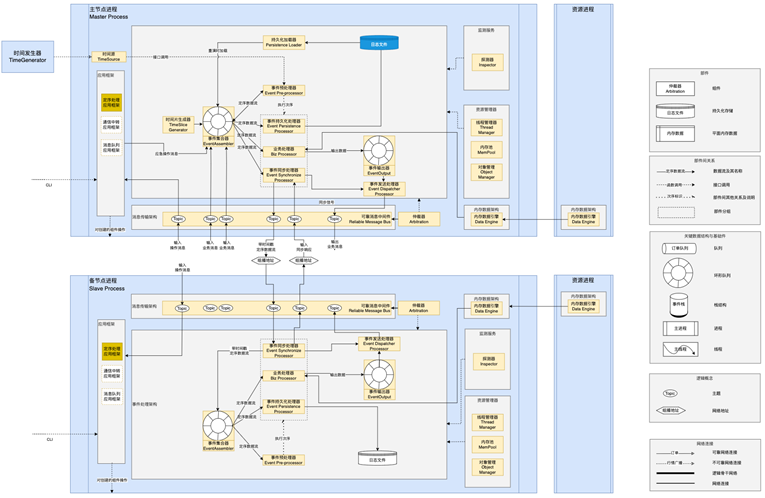
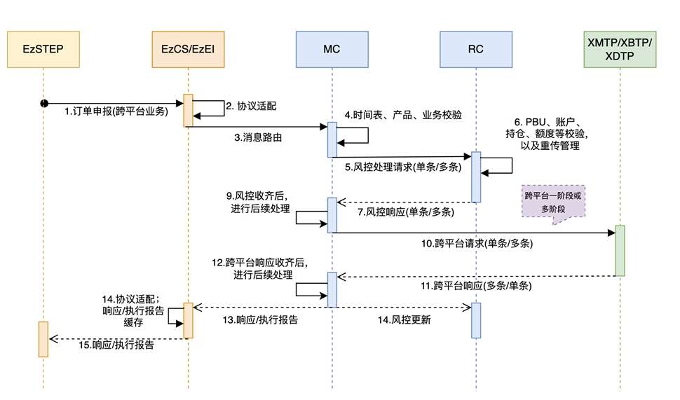

# 上交所技术公司工作经历分享

## 0.前言

由于上交所的特殊性，本次分享的关于上交所以及核心交易系统的相关内容，**没有参考**官方文档，属个人经历经验分享。本人在2022.07.18至2024.08.23期间，在上交所技术公司-研发一部-实时交易部-新港股通新综业项目组从事应用开发岗。

## 1.我眼中的上交所
### 1.1.体系架构

* 信息公司：行情发布、上证路演（不止有敲锣，还有腿）
* 系统运行部：很容易养出大熊猫的地方
* 业务研发部：我的大甲方（小甲方是测试）
* 架构研发部：问题单汇聚于此
* 新期权新竞价开发部：都是表面兄弟

### 1.2.管理模式（实时交易部）

| 职位     | 等级 | 人数 | 主要工作内容     |
|----------|------|------|--------------|
| 技术公司负责人 | 公司领导 | 1   | 我管不着 |
| 二级部门负责人   | M3+ | 2    | 签报事项、方案评审 |
| 架构师 | M2+ |  1   | 架构设计、技术方案评审 |
| 项目经理 | M1 |  1   | 项目管理 |
| 副经理 | T10 |  1   | 协助项目经理、跨部门技术对接 |
| 组长 | T7+ |  4   | 负责一个交易系统 |
| 高级工程师 | T6+ |  4   | 代码设计、复核 |
| “你们几个” | T1~T6（我两年T1，包C的） | 若干 | 代码生产、问题修复、文档编写、方案汇报 |

## 2.我眼中的交易系统
### 2.1.交易系统概况

### 2.2.下一代交易系统
1. 现有交易系统（老系统）
    * 操作系统：NGTS——天文学
    * 编程语言：C语言
    * 业务处理：多进程，每个进程负责几个业务；业务处理进程从收到该业务类型的消息开始，到发出处理结果结束，剩余交给架构。

2. 下一代交易系统（新系统）
    * 几个背景：
        * NGTS系统鲜有人知，遇到OS级问题需要请英方专家——需要在主流的Linux系统上运行
        * intel芯片虽然好，但是要防止被卡脖子——需要一套国产设备具有切换能力
        * 新系统上线前验证正确性——需要跟账阶段
    * 核心技术
        * 可靠组播
        * 高可用（仲裁）
        * 信创并轨
    * 切换过程对市场无感
    * 升级改造路径——债券->港股通->综业+期权->竞价
    * 固收纳入互联网交易平台，退出后台历史舞台

### 2.3.架构层与应用层

* 架构层：提供框架与组件
* 应用层：实现业务处理逻辑

* 主备与集群
* 时间源
* 架构能力

### 2.4.新综合业务平台视角
1. 业务处理流程
    
    

* 为什么分两个集群？
    * 参考数据划分
    * 功能定位
    * 负载均衡

